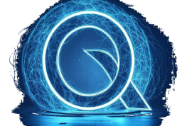
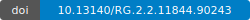
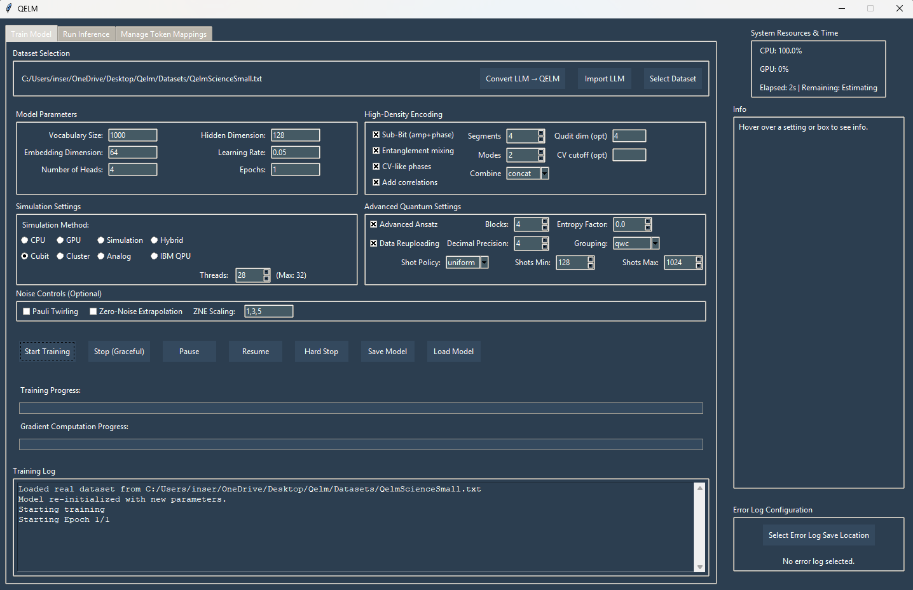
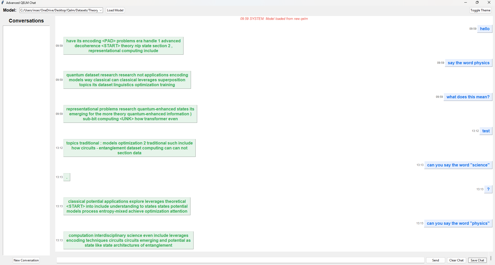
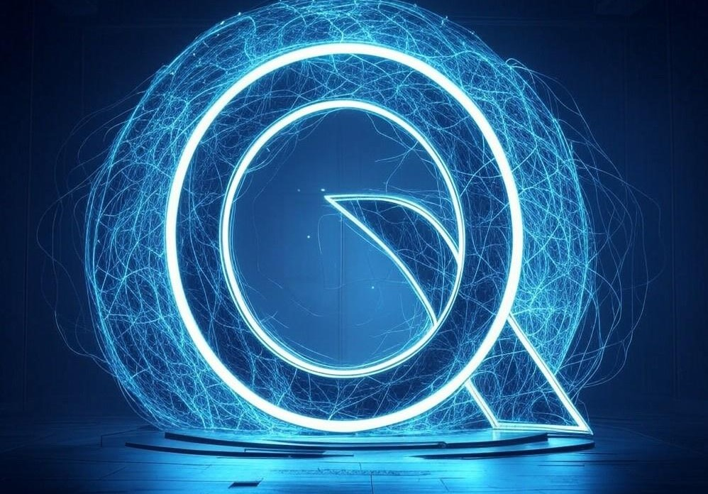
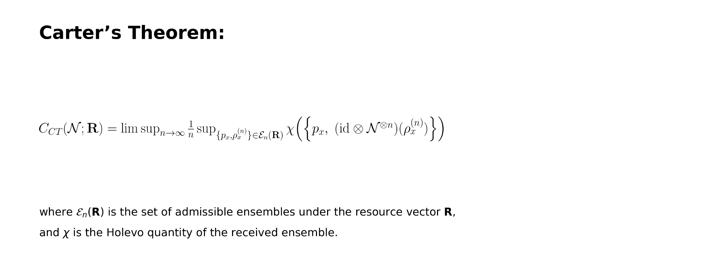

<p align="center">
  
</p>

<h1 align="center">Quantum-Enhanced Language Model</h1>

<p align="center">
  <strong>QELM</strong><br>
</p>

<p align="center">
  <a href="https://discord.gg/sr9QBj3k36">
    
  </a>
</p>

<p align="center">
  <a href="LICENSE"></a>
  
  
  
  
  <a href="https://pepy.tech/projects/qelm"></a>
  <a href="https://pypi.org/project/qelm/"></a>
  
</p>

<p align="center">
  <a href="https://doi.org/10.13140/RG.2.2.11844.90243">
    
  </a>
</p>

---

<p align="center">
  QELM is not a classical language model with a small quantum circuit attached to it.<br>
  It is a complete language-model framework built around trainable quantum circuits, quantum channels, sub-bit encoding, next-token prediction, model training, dataset preparation, multiple backends, and direct user interfaces.
</p>

<p align="center">
  <strong>Main program:</strong> <code>Qelm2.py</code>
  &nbsp;&nbsp;•&nbsp;&nbsp;
  <strong>Chat interface:</strong> <code>QELMChatUI.py</code>
  &nbsp;&nbsp;•&nbsp;&nbsp;
  <strong>Legacy implementations:</strong> <code>Outdated/</code>
</p>

 Qiskit will eventually no longer be required for every local QELM path, but it will remain recommended and an important part of QELM's development. Qiskit, Qiskit Aer, and IBM Runtime will still be required for their related simulation and hardware features. 

<p align="center">
  
</p>

---

## What QELM Is

QELM is a quantum-enhanced generative language-model architecture built to study how quantum-state information can be used directly inside language processing.

The goal is not to copy the scale or structure of modern large language models. The goal is to explore whether a much smaller architecture can use quantum states, trainable circuit parameters, phase information, channel-based processing, and hybrid memory systems to represent and learn language differently.

<table>
<tr>
<td width="50%" valign="top">

### Language-Model Core

* Token embeddings
* Sequence processing
* Quantum attention
* Quantum feed-forward layers
* Residual connections
* Vocabulary projection
* Next-token logits
* Cross-entropy loss
* Perplexity reporting

</td>
<td width="50%" valign="top">

### Quantum Core

* Quantum-channel manager
* Scalar quantum encoding
* Sub-bit encoding
* Amplitude and phase features
* Trainable quantum gates
* Entanglement
* Data reuploading
* Parameter-shift gradients
* SPSA training

</td>
</tr>
</table>

QELM also includes its own dataset preparation tools, model format, backend routing, memory systems, trainer, chat interface, error logging, model conversion experiments, and preserved legacy versions.

---

## What Makes QELM Different

<table>
<tr>
<td width="50%" valign="top">

### Quantum Channels

QELM treats quantum channels as active parts of the architecture rather than temporary circuit calls.

Channels can encode information, preserve sub-bit states, apply gates, decode state information, reset, transfer information, and route through different backend types.

</td>
<td width="50%" valign="top">

### Sub-Bit Encoding

QELM preserves both amplitude-related and phase-related information from a qubit state.

Instead of immediately reducing every state to a single measured probability, QELM can expose two related computational features to the model.

</td>
</tr>

<tr>
<td width="50%" valign="top">

### End-to-End Training

QELM is trained as a language model.

It produces vocabulary logits, calculates next-token loss, estimates gradients, updates model parameters, measures perplexity, and saves the resulting model.

</td>
<td width="50%" valign="top">

### Public and Inspectable

The architecture, older versions, training paths, model files, benchmark material, and development history are public.

The project can be downloaded, inspected, modified, tested, and challenged directly.

</td>
</tr>
</table>

---

## Sub-Bit Encoding

A pure single-qubit state can be represented as:

$$
|\psi\rangle =
\cos\left(\frac{\theta}{2}\right)|0\rangle +
e^{i\phi}\sin\left(\frac{\theta}{2}\right)|1\rangle
$$

QELM uses both coordinates of the state:

| Coordinate | Role                                                     |                 |                      |
| ---------- | -------------------------------------------------------- | --------------- | -------------------- |
| $\theta$   | Controls the amplitude relationship between the $        | 0\rangle$ and $ | 1\rangle$ components |
| $\phi$     | Controls the relative phase between the state components |                 |                      |

In a quantum circuit, the state is prepared with:

```text
RY(theta)
RZ(phi)
```

In local statevector mode, QELM constructs it directly:

```python
alpha = np.cos(theta / 2.0)
beta = np.sin(theta / 2.0) * np.exp(1j * phi)
state = np.array([alpha, beta], dtype=np.complex128)
```

When sub-bit encoding is enabled, QELM can preserve two derived paths:

| Feature           | Meaning                                                   |
| ----------------- | --------------------------------------------------------- |
| Amplitude feature | Represents the probability-related structure of the state |
| Phase feature     | Represents the relative phase structure of the state      |

The current transformer path maps an incoming value into both coordinates:

```python
sv = 1.0 / (1.0 + np.exp(-3.0 * value))
theta = 2.0 * np.arcsin(np.sqrt(sv))
phi = 2.0 * np.pi * sv
```

This produces two nonlinear quantum-state features from one incoming value.

A planned extension will allow the two coordinates to be learned independently:

$$
\theta = f_{\theta}(x)
\qquad
\phi = f_{\phi}(x)
$$

This will allow amplitude and phase to develop separate learned roles inside the model.

---

## Architecture

<p align="center">
  <code>Input text</code><br>
  ↓<br>
  <code>Tokenizer and token IDs</code><br>
  ↓<br>
  <code>Classical embeddings</code><br>
  ↓<br>
  <code>Optional context, memory, position, or knowledge processing</code><br>
  ↓<br>
  <code>Sequence weighting and aggregation</code><br>
  ↓<br>
  <code>Quantum attention</code><br>
  ↓<br>
  <code>Quantum channels and state encoding</code><br>
  ↓<br>
  <code>Entanglement and trainable circuit operations</code><br>
  ↓<br>
  <code>Quantum feed-forward processing</code><br>
  ↓<br>
  <code>Residual and normalization paths</code><br>
  ↓<br>
  <code>Vocabulary projection</code><br>
  ↓<br>
  <code>Next-token logits</code>
</p>

<table>
<tr>
<td width="50%" valign="top">

### Attention Path

* Query parameters
* Key parameters
* Value parameters
* Output parameters
* Multi-head channel processing
* Optional advanced ansatz
* Optional data reuploading

</td>
<td width="50%" valign="top">

### Output Path

* Quantum feature extraction
* Residual combination
* RMS normalization
* Sub-bit feature expansion
* Vocabulary projection
* Token probability generation
  
</td>
</tr>
</table>

---

## Main Features

<table>
<tr>
<td width="33%" valign="top">

### Model

* Configurable vocabulary
* Configurable embeddings
* Configurable attention heads
* Configurable hidden dimensions
* Transformer-block construction
* Quantum attention
* Quantum feed-forward layers
* Residual processing
* Vocabulary projection

</td>
<td width="33%" valign="top">

### Training

* Parameter-shift gradients
* SPSA
* Adam optimization
* Gradient clipping
* Gradient sampling
* Metric sampling
* Batch-shift training
* Parallel evaluation
* Learning-rate scheduling
* Update backtracking

</td>
<td width="33%" valign="top">

### Quantum Controls

* Scalar encoding
* Sub-bit encoding
* Amplitude encoding
* Data reuploading
* Entanglement
* Pauli twirling
* Zero-noise extrapolation
* Dynamic decoupling
* Entropy mixing

</td>
</tr>

<tr>
<td width="33%" valign="top">

### Memory

* Conversation history
* Quantum context
* Quantum memory
* Positional encoding
* Knowledge embeddings
* Experimental spiking systems

</td>
<td width="33%" valign="top">

### Data

* Local text preparation
* Hugging Face preparation
* Streaming datasets
* Byte-level token streams
* Subword tokenization
* Memory-mapped data

</td>
<td width="33%" valign="top">

### Tools

* Trainer GUI
* Model creation
* Model save and load
* Token-map management
* Live training logs
* Backend selection
* Model conversion experiments
* Lightweight chat interface

</td>
</tr>
</table>

---

## Backend Support

| Backend        | Purpose                                       | Status       |
| -------------- | --------------------------------------------- | ------------ |
| CPU            | Local QELM circuit and statevector processing | Supported    |
| Qiskit Aer     | Local quantum simulation                      | Supported    |
| IBM Quantum    | Real quantum hardware and Runtime paths       | Supported    |
| GPU            | Accelerated simulation where compatible       | Experimental |
| Cubit          | Cubit and quantum-emulator integration        | Experimental |
| Analog         | Analog-style drift and state evolution        | Experimental |
| Hybrid         | Alternate logical-qubit representations       | Experimental |
| Cluster / MBQC | Cluster-state and measurement-based paths     | Experimental |

Not every feature behaves identically across every backend. Small models should be used before beginning large hardware or experimental runs.

---

## Quick Start

### Install from PyPI

```bash
pip install qelm
```

### Clone the repository

```bash
git clone https://github.com/R-D-BioTech-Alaska/QELM.git
cd QELM
```

### Start QELM

```bash
python Qelm2.py
```

The main interface controls:

* Model dimensions
* Backend selection
* Thread count
* Sub-bit encoding
* Amplitude encoding
* Entanglement
* Data reuploading
* Noise mitigation
* Memory and context
* Gradient method
* Dataset loading
* Training
* Model saving

<details>
<summary><strong>Full installation instructions</strong></summary>

### Recommended environment

* Python 3.11
* NumPy
* Tkinter
* Qiskit
* Qiskit Aer
* psutil
* datasets for Hugging Face preparation
* PyTorch for supported GPU and model-conversion paths
* TensorFlow only for older or experimental modules that still use it

### Create a virtual environment

```bash
python -m venv qelm_env
```

Linux or macOS:

```bash
source qelm_env/bin/activate
```

Windows:

```bash
qelm_env\Scripts\activate
```

### Install dependencies

```bash
python -m pip install --upgrade pip
pip install -r requirements.txt
```

### Python 3.11.7

[Download Python 3.11.7](https://www.python.org/ftp/python/3.11.7/)

</details>

---

## Dataset Preparation

QELM includes command-line tools for preparing large token streams before training.

<table>
<tr>
<td width="50%" valign="top">

### Local Text

```bash
python Qelm2.py --qelm_prep_tokens \
  --input Science.txt \
  --output Science.tokens
```

Creates a binary `uint16` token stream using byte-level values and reserved special tokens.

</td>
<td width="50%" valign="top">

### Hugging Face

```bash
python Qelm2.py --qelm_prep_hf \
  --dataset Salesforce/wikitext \
  --config wikitext-2-raw-v1 \
  --split train \
  --output wikitext2.tokens
```

Attempts streaming first and falls back to a normal dataset load when needed.

</td>
</tr>
</table>

---

## Training

QELM can train with:

* Parameter-shift gradients
* SPSA
* Adam updates
* Batch-shift processing
* Sampled gradient subsets
* Sampled metric subsets
* Parallel workers
* Gradient clipping
* Learning-rate control
* Optional data reuploading

During training, QELM can report:

| Training           | Evaluation                 |
| ------------------ | -------------------------- |
| Current epoch      | Cross-entropy loss         |
| Gradient progress  | Perplexity                 |
| Gradient magnitude | Embedding coverage         |
| Elapsed time       | Estimated remaining time   |
| Learning rate      | Model and parameter status |

### Main outputs

* `.qelm` model file
* Matching token-map file
* Training logs
* Loss and perplexity results
* Crash and soft-failure logs when needed

---

## Model Files

A `.qelm` model can contain:

<table>
<tr>
<td width="50%" valign="top">

* Model version
* Vocabulary size
* Embedding dimensions
* Hidden dimensions
* Attention settings
* Quantum parameters
* Feature settings

</td>
<td width="50%" valign="top">

* Embedding weights
* Projection weights
* Output weights
* Output bias
* Token mappings
* Backend settings
* Sub-bit settings

</td>
</tr>
</table>

Keep the model and matching token map together:

```text
model_name.qelm
model_name_token_map.json
```

---

## QELM Chat UI

<p align="center">
  
</p>

Run the separate chat interface with:

```bash
python QELMChatUI.py
```

The interface includes:

* Model loading
* Token-map loading
* Message history
* Temperature control
* Maximum token control
* Theme settings
* Font settings

`Qelm2.py` contains the complete current quantum-enhanced training and model-execution architecture.

`QELMChatUI.py` is a lightweight interface for saved models and does not currently reconstruct every quantum circuit component used by the full trainer.

The example model shown in the interface is approximately 23 KB.

---

## IBM Quantum Hardware

<details>
<summary><strong>IBM Quantum setup</strong></summary>

```python
from qiskit_ibm_runtime import QiskitRuntimeService

service = QiskitRuntimeService(
    channel="ibm_quantum",
    token="YOUR_TOKEN"
)

backend = service.backend("BACKEND_NAME")
```

Before submitting a hardware run:

* Confirm the backend is online
* Check available qubits
* Check queue time
* Check shot and runtime limits
* Save the local model
* Begin with a small circuit

Real quantum hardware behaves differently from local statevector simulation because of noise, measurement limits, queue delays, and backend restrictions.

</details>

---

## Benchmarks

QELM reports standard language-model and training measurements.

<table>
<tr>
<td width="50%" valign="top">

### Main Metrics

* Cross-entropy loss
* Perplexity
* Epoch time
* Gradient norm
* Gradient samples
* Embedding coverage
* Model file size

</td>
<td width="50%" valign="top">

### Optional Metrics

* Top-k accuracy
* BLEU
* Distinct-n
* Token diversity
* Repetition rate
* Backend timing
* Hardware shot statistics

</td>
</tr>
</table>

A useful QELM benchmark should include:

| Category | Required Information                                       |
| -------- | ---------------------------------------------------------- |
| Source   | Commit or release tag                                      |
| Data     | Dataset, configuration, size, and tokenizer                |
| Model    | Vocabulary, embedding size, heads, hidden size, and blocks |
| Quantum  | Encoding, entanglement, reuploading, and backend           |
| Training | Optimizer, gradient method, learning rate, and epochs      |
| Results  | Loss, perplexity, runtime, and model size                  |
| Hardware | CPU, RAM, GPU, operating system, or QPU                    |

Results without their configuration are difficult to reproduce or compare.

---

## Current Status

<table>
<tr>
<td width="50%" valign="top">

### Stable Core

* Local model creation
* Dataset preparation
* Token mapping
* Model serialization
* Quantum channels
* Scalar encoding
* Sub-bit encoding
* Local statevector processing
* Parameter-shift training
* SPSA
* Adam
* Trainer GUI

</td>
<td width="50%" valign="top">

### Active Development

* Full sequential execution through all configured blocks
* Independently learned $\theta$ and $\phi$
* Expanded GPU execution
* Larger-model performance
* IBM Runtime improvements
* Model conversion
* Tokenizer plugins
* Automated benchmark reports
* QSA, Qubit, and Neuron integration

</td>
</tr>
</table>

Experimental does not mean hidden or theoretical. QELM is public, usable, inspectable, and actively changing.

---

## Development History

QELM has been developed publicly, with its source, releases, older implementations, benchmark files, and continued changes preserved in the repository.

The older files are kept intentionally because they show the progression of:

* Quantum channels
* Sub-bit encoding
* Circuit construction
* Training systems
* Backend experiments
* Model serialization
* Interfaces
* Benchmarks

The development history is part of QELM and preserves when its architecture and major features were introduced.

---

## Project Structure

<details>
<summary><strong>Repository structure</strong></summary>

```text
QELM/
├── Qelm2.py
├── QELMChatUI.py
├── Cubit.py
├── requirements.txt
├── setup.py
├── Benchmark/
├── Datasets/
├── Documentation/
├── Outdated/
├── badges/
├── docs/
│   └── images/
├── README.md
└── LICENSE
```

</details>

<p align="center">
  
</p>

---

## Roadmap

<table>
<tr>
<td width="50%" valign="top">

### Architecture and Training

* Sequential multi-block execution
* Independent sub-bit projections
* Faster parameter-shift evaluation
* Improved SPSA schedules
* Better distributed training
* GPU acceleration
* Automatic checkpoints

</td>
<td width="50%" valign="top">

### Backends and Evaluation

* Deeper Cubit and Qubit integration
* QSA integration
* Analog and hybrid improvements
* Automated benchmark reports
* Backend comparisons
* Sub-bit comparison testing
* Automatic circuit diagrams

</td>
</tr>
</table>

---

<p align="center">
  
</p>

---

## Citation

**DOI:** [10.13140/RG.2.2.11844.90243](https://doi.org/10.13140/RG.2.2.11844.90243)

Carter, Brenton. *Quantum-Enhanced Language Model (QELM).*
R&D BioTech Alaska.
DOI: 10.13140/RG.2.2.11844.90243

When citing a specific implementation or benchmark, include the Git commit or release tag used.

---

## Contributing

Issues, tests, benchmark results, documentation fixes, backend improvements, and pull requests are welcome.

Useful contributions include:

* Reproducing training runs
* Testing different systems
* Improving backend compatibility
* Adding benchmark configurations
* Improving gradient performance
* Adding unit tests
* Comparing sub-bit and standard encoding
* Improving documentation

Bug reports should include:

* Operating system
* Python version
* Qiskit and Aer versions
* Backend
* Model settings
* Dataset
* Full error message
* Steps needed to reproduce the issue

---

## License

QELM is licensed under the **MIT License**.

See [LICENSE](LICENSE) for details.

---

## Contact

<p align="center">
  <a href="mailto:contact@rdbiotechalaska.com">contact@rdbiotechalaska.com</a>
  &nbsp;&nbsp;•&nbsp;&nbsp;
  <a href="mailto:contact@qelm.org">contact@qelm.org</a>
  &nbsp;&nbsp;•&nbsp;&nbsp;
  <a href="https://github.com/R-D-BioTech-Alaska">GitHub</a>
  &nbsp;&nbsp;•&nbsp;&nbsp;
  <a href="http://RDBioTech.org">RDBioTech.org</a>
  &nbsp;&nbsp;•&nbsp;&nbsp;
  <a href="https://Qelm.org">Qelm.org</a>
</p>

<p align="center">
  <a href="https://discord.gg/sr9QBj3k36">Join the QELM Discord</a>
  &nbsp;&nbsp;•&nbsp;&nbsp;
  <a href="https://www.linkedin.com/comm/mynetwork/discovery-see-all?usecase=PEOPLE_FOLLOWS&followMember=inserian">Follow on LinkedIn</a>
</p>

<p align="center">
  <sub>QELM is a public research architecture under active development. Its source code, older versions, training paths, model structure, and current work are available for inspection, use, modification, and testing.</sub>
</p>
