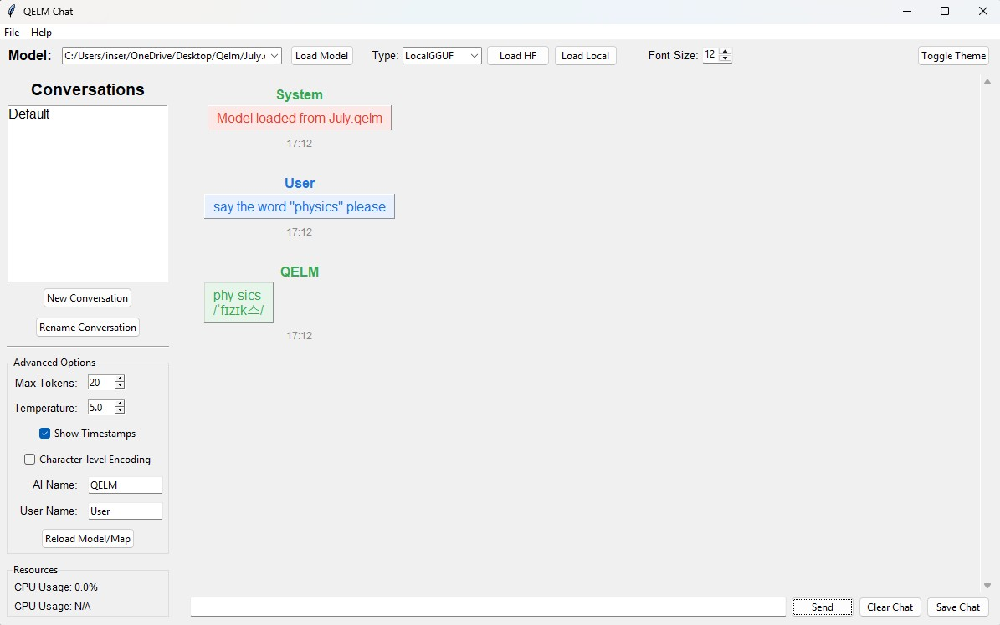

<p align="center">
  
</p>

<p align="center">
  <a href="https://discord.gg/sr9QBj3k36">
    
  </a>
</p>

# Quantum-Enhanced Language Model (QELM)
[](LICENSE)     [](https://pepy.tech/projects/qelm) [](https://pypi.org/project/qelm/) 
[](https://doi.org/10.13140/RG.2.2.11844.90243)

**QELM** (Quantum-Enhanced Language Model) combines **quantum computing** and **NLP** to create compact yet powerful language models.

**Main script (current):** `Qelm2.py` (trainer + GUI + utilities)  
**Legacy script:** `QelmT.py` (older unified trainer/inference)

The latest versions feature:
- Multi-block quantum transformer architecture with advanced multi-head quantum attention.
- Novel techniques such as **sub-bit encoding** and **entropy-mixed gates** that allow more representational power per qubit.
- Parameter-shift gradient training (with support for Adam and advanced quantum training modes).
- A unified **GUI-first** workflow in `Qelm2.py` for training, saving/loading, token maps, and advanced toggles.
- **Noise mitigation options**: **Pauli twirling** and **zero-noise extrapolation (ZNE)** with user-configurable scaling factors.
- Utility modes for dataset/token preprocessing, including local and HuggingFace prep flags.

**QELM Quantum** (Connect to IBM quantum computers)  
- Must have an IBM account  
- Must have a basic understanding of running circuits  
- Must be familiar with Quantum Computers (you can switch backends in the UI; mind shot/runtime budgets)

---

## TensorFlow & Python Version Compatibility

TensorFlow is **not yet compatible** with the latest versions of Python.  
To install a working Python version, use the **official Python FTP archive**, as they no longer provide an executable for this version or lower:

 **[Download Python 3.11.7](https://www.python.org/ftp/python/3.11.7/)**  

*Note: QELM’s core trainer does not require TensorFlow; TensorFlow is optional for experimental modules.*

---

## Table of Contents
1. [What’s New in Qelm2.py?](#whats-new-in-qelm2py)
2. [Architecture Overview](#architecture-overview)
3. [Feature Matrix](#feature-matrix)
4. [Features](#features)
5. [Installation](#installation)  
   5.1. [Prerequisites](#prerequisites)  
   5.2. [Easy Installation](#easy-installation)  
   5.3. [Cloning the Repository](#cloning-the-repository)  
   5.4. [Virtual Environment Setup](#virtual-environment-setup)  
   5.5. [Dependency Installation](#dependency-installation)
6. [Training with Qelm2.py](#training-with-qelm2py)
7. [Chatting with QELMChatUI.py](#chatting-with-qelmchatuipy)
8. [Benchmarks & Metrics](#benchmarks--metrics)
9. [Running on Real QPUs (IBM, etc.)](#running-on-real-qpus-ibm-etc)
10. [Project Structure](#project-structure)
11. [Roadmap](#roadmap)
12. [License](#license)
13. [Contact](#contact)

---


---

## What’s New in Qelm2.py?

### Qelm2.py (Trainer + GUI + Utilities)
- **Unified GUI workflow:** configure model, train, save/load `.qelm`, manage token maps, and run inference from one interface.
- **Noise mitigation:** GUI toggles for **Pauli twirling** and **ZNE**, plus a scaling-factor field (e.g., `1,3,5`).
- **Token/dataset tooling:** built-in prep modes for generating token streams:
  - `--qelm_prep_tokens` for local text → token stream
  - `--qelm_prep_hf` for HuggingFace datasets → token stream
- **LLM → QELM conversion:** import LLM weights then convert using your selected encoder/architecture options (where supported by your import path).

---

## Architecture Overview
QELM mirrors a transformer but swaps heavy linear algebra blocks for compact quantum circuits:

1. **Classical Embeddings** → token → vector  
2. **Quantum Attention (per head)** → encode vector into qubits, entangle, extract features  
3. **Quantum Feed-Forward / Channel Mixing** → circuit blocks with trainable parameters  
4. **Residual / Combine** → classical post-processing  
5. **Output Projection** → vocab logits  

Optional add-ons depend on your enabled flags (encoding modes, memory/context, mitigation, conversion encoders, etc.).

---

## Feature Matrix
| Area        | Feature                             | Old (`qelm.py` / `QelmT.py`) | New (`Qelm2.py`) |
|-------------|-------------------------------------|------------------------------|------------------|
| Encoding     | Scalar RY / basic encoding          | ✔                            | ✔                |
|             | Sub-bit encoding                    | ✔                            | ✔ (toggle)       |
|             | Advanced encoder options            | limited                      | expanded         |
| Attention    | Single-block fallback               | ✔                            | Multi-block      |
| Training     | Parameter-shift gradients           | ✔                            | ✔                |
| Optimizers   | Adam + advanced modes               | ✔                            | ✔                |
| GUI          | Trainer UI                          | ✔                            | New consolidated UI |
| Utilities    | Token/dataset prep modes            | limited                      | ✔ (`--qelm_prep_tokens`, `--qelm_prep_hf`) |
| Noise        | Pauli twirling & ZNE                | ✔ / partial                  | ✔ (GUI toggle + scaling) |

---

## Features

- **Quantum Circuit Transformers:**  
  - Multi-block transformer architecture with quantum attention and feed-forward layers  
  - Ring entanglement, data reuploading (when enabled), and residual connections

- **Quantum Training Optimizations:**  
  - Parameter-shift gradient training with Adam and advanced training modes

- **Advanced Quantum Techniques:**  
  - Sub-bit encoding and entropy-controlled quantum channels  
  - Multiple ansatz/encoding options for experimental setups  
  - **Noise mitigation:** Pauli twirling and zero-noise extrapolation (ZNE), with selectable scaling factors

- **Unified Script (Qelm2.py):**  
  - One consolidated script for training, inference, model save/load, token maps, and utilities  
  - CLI tool modes for dataset/token prep

- **Modern Chat UI (QELMChatUI.py):**  
  - ChatGPT-style conversation interface with message bubbles and session handling (where implemented)  
  - Loads `.qelm` models + token maps to generate readable natural language

---

## Installation

### Prerequisites
- **Python 3.7+** (commonly tested up to 3.11)
- **Qiskit** and **Qiskit Aer**
- **NumPy**
- **Tkinter** (usually included with Python)
- **psutil** (optional, for CPU usage monitoring)
- **datasets** (optional; only required for `--qelm_prep_hf`)

### Easy Installation
```bash
pip install qelm
````

### Cloning the Repository

```bash
git clone https://github.com/R-D-BioTech-Alaska/QELM.git
cd QELM
```

### Virtual Environment Setup

```bash
python -m venv qelm_env

# On Linux/Mac:
source qelm_env/bin/activate

# On Windows:
qelm_env\Scripts\activate
```

### Dependency Installation

```bash
pip install --upgrade pip
pip install -r requirements.txt
```

---

## Training with Qelm2.py

Run the trainer UI:

```bash
python Qelm2.py
```

Outputs:

* `.qelm` model file
* `<modelname>_token_map.json`
* Training logs (loss/perplexity where enabled)

---

## Chatting with QELMChatUI.py

(This model is 23 kb's in size)


The `QELMChatUI.py` script provides a ChatGPT-style interface for interacting with your QELM models.

* **Model and Token Mapping:**
  Load your `.qelm` model file along with the matching token mapping file (`*_token_map.json`) so responses map to real words.
* **Modern Chat Interface:**
  Message bubbles, history/session behavior, and UI features as implemented in your current chat build.

To run the chat UI:

```bash
python QELMChatUI.py
```

---

## Benchmarks & Metrics

Core metrics to report:

* **Loss / Cross-Entropy**
* **Perplexity**
* Optional text metrics (BLEU / distinct-n) if you enable them in your evaluation workflow

---

## Running on Real QPUs (IBM, etc.)

If you run against IBM backends, ensure credentials are configured and select the backend you want.

Minimal example:

```python
from qiskit_ibm_runtime import QiskitRuntimeService
service = QiskitRuntimeService(channel="ibm_quantum", token="YOUR_TOKEN")
backend = service.backend("BACKEND_NAME")
```

---

## Project Structure

```
QELM/
├── Qelm2.py                 # Main consolidated trainer + GUI + utilities
├── QelmT.py                 # Legacy trainer/inference (reference)
├── QELMChatUI.py            # Chat interface for QELM models
├── requirements.txt
├── Datasets/
├── docs/
│   └── images/
│       ├── qelm_logo_small.png
│       ├── qelmtrainer.png
│       ├── QELM_Diagram.png
│       ├── quantum.png
│       ├── chat.png
│       └── ctheo.jpg
├── README.md
└── LICENSE
```


---

## Roadmap

* Backend abstraction beyond Aer/IBM
* Automated benchmark script: perplexity/BLEU/top-k in one JSON report
* Tokenizer upgrades: plug-in BPE/Unigram tokenizers
* Auto circuit diagrams per block for documentation

---

<p align="center">
  
</p>

---

## License

This project is licensed under the **MIT License**. See the [LICENSE](LICENSE) file for details.

---

## Contact

For additional guidance, collaboration, or bug reports:

* **Email**: [contact@rdbiotechalaska.com](mailto:contact@rdbiotechalaska.com)
* **Email**: [contact@qelm.org](mailto:contact@qelm.org)
* **GitHub**: [R-D-BioTech-Alaska](https://github.com/R-D-BioTech-Alaska)
* **Website**: [RDBioTech.org](http://RDBioTech.org)
* **Website**: [Qelm.org](https://Qelm.org)

<a class="libutton" href="https://www.linkedin.com/comm/mynetwork/discovery-see-all?usecase=PEOPLE_FOLLOWS&followMember=inserian" target="_blank">Follow on LinkedIn</a>

<sub>(*Disclaimer: QELM is experimental; community feedback is greatly appreciated.*)</sub>
